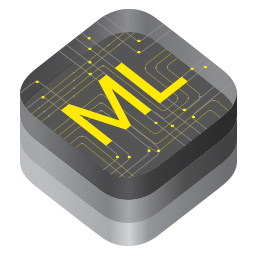

# CoreML Code Snippets

Random code snippets while learning CoreML - an iOS framework for running trained Machine Learning models.

### Image Detection

* Real-time capture using AVCaptureSession.
* Uses a CoreML Model (Resnet50.mlmodel) to detect objects within the captured data.
* Reports the detected objects and confidence level.

## References

* [Introducing CoreML](https://developer.apple.com/videos/play/wwdc2017/703/) - WWDC 2017 presentation
* [CoreML In Depth](https://developer.apple.com/videos/play/wwdc2017/710/) - WWDC 2017 presentation
* [CoreML Tools](https://pypi.python.org/pypi/coremltools) - for converting trained Machine Learning models for use in iOS apps.

## Connect

* Twitter: [@clintcabanero](http://twitter.com/clintcabanero)
* GitHub: [ccabanero](http:///github.com/ccabanero)
